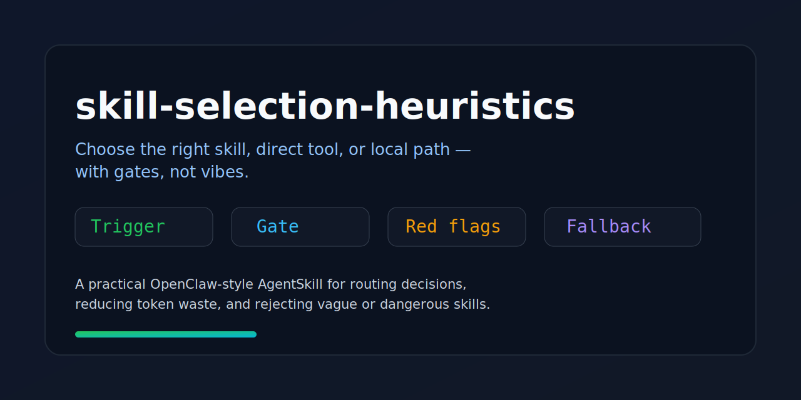
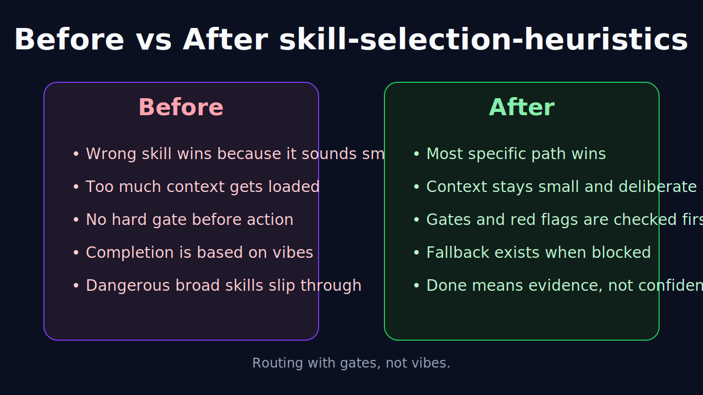

# skill-selection-heuristics

> Stop choosing skills by vibes.

A practical AgentSkill for OpenClaw-style agents that need to decide between:

- using a skill
- using a direct tool
- making a small local edit
- rejecting a vague or dangerous skill entirely

This project turns skill choice into **routing with gates**, not hand-wavy intuition.

---

## Why this exists

As skill ecosystems grow, agents start hitting a very real problem:

- too many overlapping skills
- vague trigger descriptions
- "do everything" meta-skills
- context wasted on the wrong skill
- advice-heavy skills with no stop conditions
- fake confidence from skills that *sound* smart but don't enforce anything

The result is predictable:

- wrong skill chosen
- too much context loaded
- higher token cost
- less reliable execution
- more hallucinated completion

This skill exists to reduce that.

---

## Before / After

Without this kind of routing skill, agents tend to over-trigger broad skills, load too much context, and call work complete too early.

With it, routing becomes narrower, safer, and cheaper.

---

## What the skill does

`skill-selection-heuristics` helps an agent:

1. decide whether a skill is even needed
2. choose between multiple candidate skills
3. reject over-broad or unsafe skills
4. prefer direct execution when a skill would be overhead
5. evaluate skill quality using hard criteria
6. report its choice in a compact, structured way

---

## Core idea

A strong skill should have:

- **clear trigger conditions**
- **clear non-trigger conditions**
- **hard gates**
- **red flags**
- **fallback behavior**
- **constrained output shape**

If it doesn't, it's probably documentation — not a strong skill.

---

## Included files

- `SKILL.md` — the actual AgentSkill definition
- `references/examples.md` — concrete routing examples
- `references/scorecard.md` — quick scoring framework for skill quality
- `references/bad-skill-checklist.md` — fast rejection checklist
- `assets/banner.svg` — repository banner
- `assets/before-after.svg` — visual explainer
- `LICENSE` — MIT
- `.gitignore`

---

## Best use cases

Use this when:

- multiple skills seem to match one task
- a task keeps slowing down because the wrong skill triggers
- reviewing a skill before adopting it
- creating a new skill and wanting stronger boundaries
- deciding between *load a skill* vs *just do the work directly*

Do **not** use this for:

- trivial one-step tasks
- direct reads/writes/edits with obvious tooling
- situations where a known, specific skill clearly dominates already

---

## The design philosophy

This project strongly prefers:

- narrow scope over broad promises
- gates over suggestions
- routing over vibes
- evidence over completion theater
- small context over context bloat

A skill should not just make an agent *sound* competent.
It should make the agent **less likely to do dumb things**.

---

## Example questions this skill helps answer

- "Should I load a planning skill for this, or just work directly?"
- "Two skills match — which one wins?"
- "Is this skill useful, or just long and vague?"
- "Should I trust this newly discovered skill enough to use it?"
- "Is the skill reducing complexity, or adding complexity?"

For concrete walk-throughs, see [references/examples.md](references/examples.md).

---

## What this skill optimizes for

### 1. Lower token waste
Avoid loading large, vague skills when direct execution is cheaper.

### 2. Better routing
Choose the most specific skill instead of the loudest one.

### 3. Better safety
Reject skills that imply hidden installs, broad authority, or external writes without strong boundaries.

### 4. Better completion quality
Prefer skills that include verification gates and failure fallbacks.

---

## Quality heuristics used by the skill

The skill prefers candidates that are:

- narrow in scope
- explicit about when to use them
- explicit about when **not** to use them
- backed by gates, red flags, and fallback rules
- cheaper than improvising from scratch
- inspectable and proportionate to the task

The skill rejects candidates that are:

- overly broad
- mostly prose with no routing value
- missing verification logic
- missing stop conditions
- high-blast-radius without justification
- likely to pollute context more than they help

For a quick review rubric, see [references/scorecard.md](references/scorecard.md).
For a fast reject pass, see [references/bad-skill-checklist.md](references/bad-skill-checklist.md).

---

## Example output shape

When used well, the skill should drive output like:

- **Candidate skills:** ...
- **Chosen path:** ...
- **Why this path wins:** ...
- **Rejected options:** ...
- **Key gate:** ...
- **Next step:** ...

---

## Who this is for

This is most useful for:

- OpenClaw users building a serious local skill library
- agents that juggle multiple overlapping workflows
- people tired of vague automation frameworks
- anyone who wants more reliable skill routing with less token waste

---

## A tiny quality scorecard

You can quickly score a skill on:

- trigger clarity
- non-trigger clarity
- gate strength
- red flags
- fallback path
- output shape
- cost efficiency
- trust surface

Full version: [references/scorecard.md](references/scorecard.md)

---

## Roadmap ideas

Potential future additions:

- a trust-scoring companion skill
- a skill-architecture-review companion skill
- a small reference catalog of good vs bad trigger patterns
- a machine-readable scoring schema for skill quality

---

## Repository goal

This repo is intentionally small.

The goal is not to build a giant framework.
The goal is to publish one useful, inspectable skill that solves one annoying problem well.

---

## License

MIT
